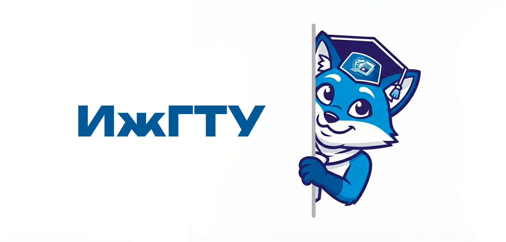

  

<h1 align="center">CheckScheduleTelegramBot</h1>

  📚 Телеграм-бот, который помогает студентам никогда не опаздывать на пары

  
  
  

# ПРИМЕЧАНИЕ
*Данный бот находится в разработке, основная идея есть в скриптах. Осталось исключительно реализовать  базу данных*

## 📝 О проекте

CheckScheduleBot - это проект, созданный для того, чтобы студенты могли легко получать доступ к расписанию занятий через Telegram. Создан с использованием Python и фреймворка Aiogram, обеспечивает простой способ следить за своим учебным расписанием.

## 🌟 Возможности

- 📅 **Расписание на день** - Получайте расписание занятий на любой день
- 👨‍🏫 **Информация о преподавателях** - Узнавайте, где и когда ведут занятия преподаватели(В скором времени будет реализована)
- 🔄 **Автообновление** - Информация о расписании обновляется автоматически(в разработке)
- 📱 **Удобный интерфейс** - Простой и интуитивно понятный интерфейс Telegram

## 🚀 Начало работы

### Необходимые компоненты

- Python 3.7+
- Аккаунт в Telegram
- Токен Telegram-бота (от [@BotFather](https://t.me/BotFather))

## 📖 Использование

1. Начните диалог с вашим ботом в Telegram
2. Отправьте команду `/start` для активации бота
3. Нажмите кнопку "Расписание"
4. Выберите, как вы хотите просматривать расписание:
   - Расписание на сегодня
   - Расписание на завтра
   - Расписание на неделю

## 🛠️ Используемые технологии

- [Python](https://www.python.org/) - Язык программирования
- [Aiogram](https://docs.aiogram.dev/) - Фреймворк для Telegram Bot API
- [BeautifulSoup](https://www.crummy.com/software/BeautifulSoup/) - Библиотека для парсинга веб-страниц
- [python-dotenv](https://github.com/theskumar/python-dotenv) - Управление переменными окружения

## 📄 Лицензия

Этот проект лицензирован по лицензии MIT - см. файл [LICENSE](LICENSE) для подробностей.

## 📬 Обратная связь

Если у вас есть какие-либо предложения или вопросы, пожалуйста, откройте issue на GitHub.